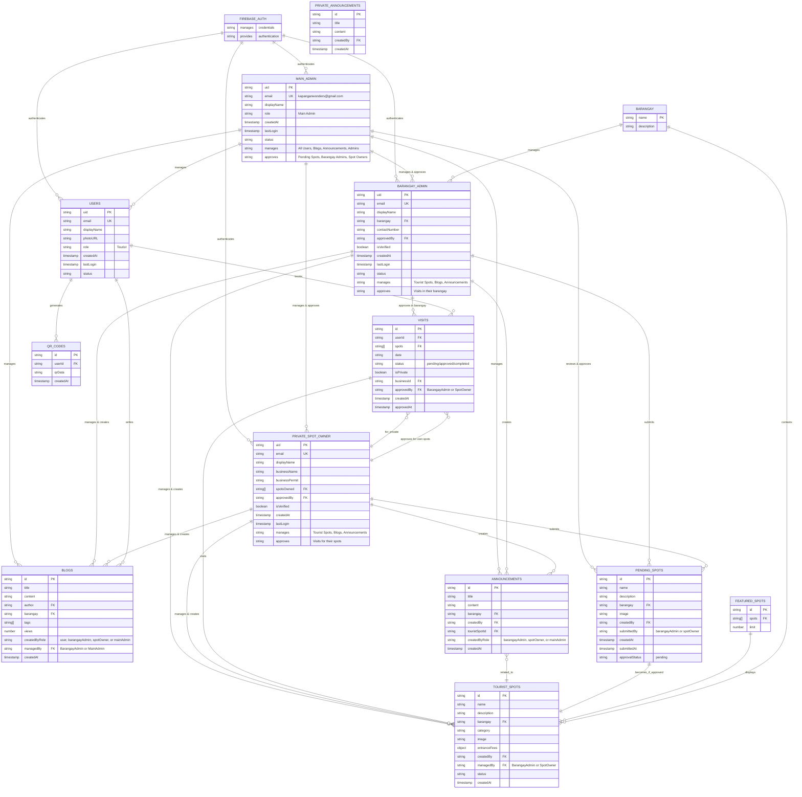

# KapanganWonders Entity Relationship Diagram (ERD)

## Database Overview
This application uses **Firebase Firestore** as the primary database. Below is the complete entity relationship diagram showing all collections, their fields, and relationships.

---

## Collections & Entities

### 1. **Users** (Tourist/Regular Users)
```
Collection: 'users'
├── uid (String, PK) - Firebase Auth UID
├── email (String, Unique)
├── displayName (String)
├── photoURL (String)
├── role (String) - 'Tourist'
├── provider (String) - 'google' | 'email'
├── createdAt (Timestamp)
├── lastLogin (Timestamp)
└── status (String) - 'Active' | 'Inactive' | 'Suspended'
```

---

### 2. **Main Admin**
```
Collection: 'barangayAdmins' (identified by email)
├── uid (String, PK) - Firebase Auth UID
├── email (String, Unique) - MUST be 'kapanganwonders@gmail.com'
├── displayName (String)
├── photoURL (String)
├── role (String) - 'Main Admin'
├── createdAt (Timestamp)
├── lastLogin (Timestamp)
└── status (String) - 'Active' | 'Inactive' | 'Suspended'

⚠️ IMPORTANT: Only ONE main admin exists with email = 'kapanganwonders@gmail.com'
- Full system access
- Can delete users
- Can approve/reject barangay admins and private spot owners
- Accesses /admin dashboard
- No specific barangay assignment
```

---

### 3. **Barangay Admins**
```
Collection: 'barangayAdmins'
├── uid (String, PK) - Firebase Auth UID
├── email (String, Unique)
├── displayName (String)
├── photoURL (String)
├── role (String) - 'Barangay Admin'
├── barangay (String) - Barangay name (FK to Barangay)
├── contactNumber (String)
├── createdAt (Timestamp)
├── lastLogin (Timestamp)
├── status (String) - 'Active' | 'Inactive' | 'Suspended'
├── approvedBy (String, FK) - Main admin uid who approved
├── approvedAt (Timestamp)
└── isVerified (Boolean)
```

---

### 4. **Private Spot Owners**
```
Collection: 'privateSpotOwners'
├── uid (String, PK) - Firebase Auth UID
├── email (String, Unique)
├── displayName (String)
├── photoURL (String)
├── role (String) - 'Private Spot Owner'
├── businessName (String)
├── businessAddress (String)
├── contactNumber (String)
├── businessPermitNumber (String)
├── createdAt (Timestamp)
├── lastLogin (Timestamp)
├── status (String) - 'Active' | 'Inactive' | 'Suspended'
├── approvedBy (String, FK) - Admin uid who approved
├── approvedAt (Timestamp)
├── isVerified (Boolean)
└── spotsOwned (Array<String>) - Array of spot IDs (FK to Tourist Spots)
```

---

### 5. **Tourist Spots** (Approved)
```
Collection: 'touristSpots'
├── id (String, PK) - Firestore doc ID
├── name (String)
├── description (String)
├── detailedDescription (String)
├── image (String) - Image URL from Appwrite
├── location (String)
├── barangay (String) - (FK to Barangay)
├── category (String) - 'Natural Attractions' | 'Agricultural Heritage' | etc.
├── contact (String)
├── googleMapsLink (String)
├── createdBy (String, FK) - User/Admin ID who created
├── createdAt (Timestamp)
├── updatedAt (Timestamp)
├── addedBy (String, FK) - User/Admin ID
├── status (String) - 'approved' | 'pending' | 'rejected'
├── rejectionReason (String)
└── entranceFees (Object)
    ├── adults { label, amount }
    ├── seniors { label, amount }
    ├── pwd { label, amount }
    ├── kids { label, amount }
    ├── children { label, amount }
    ├── environmental { label, amount }
    └── tourGuide { label, amount }
```

---

### 6. **Pending Spots** (Under Review)
```
Collection: 'pendingSpots'
├── id (String, PK) - Firestore doc ID
├── name (String)
├── description (String)
├── detailedDescription (String)
├── image (String) - Image URL from Appwrite
├── location (String)
├── barangay (String) - (FK to Barangay)
├── category (String)
├── contact (String)
├── googleMapsLink (String)
├── createdBy (String, FK) - User/Admin ID who submitted
├── createdAt (Timestamp)
├── updatedAt (Timestamp)
├── addedBy (String, FK) - User/Admin ID
└── entranceFees (Object)
```

---

### 7. **Visits** (Booking/Visit Records)
```
Collection: 'visits'
├── id (String, PK) - Firestore doc ID
├── fullName (String) - Visitor name
├── email (String)
├── contactNumber (String)
├── date (String) - Visit date
├── barangays (Array<String>) - Barangays to visit
├── spots (Array<String>) - Tourist spot IDs (FK to Tourist Spots)
├── spotNames (Array<String>) - Names of spots
├── status (String) - 'Completed' | 'Cancelled' | 'Pending'
├── userId (String, FK) - Tourist user ID
├── isPrivate (Boolean) - Private spot visit flag
├── businessId (String, FK) - Private spot owner ID (if isPrivate)
├── businessName (String)
├── createdAt (Timestamp)
└── updatedAt (Timestamp)
```

---

### 8. **Announcements**
```
Collection: 'announcements'
├── id (String, PK) - Firestore doc ID
├── title (String)
├── content (String)
├── category (String) - 'Construction' | 'Weather' | 'Information' | etc.
├── barangay (String) - (FK to Barangay)
├── createdBy (String, FK) - Admin/User ID who created
├── createdAt (Timestamp)
├── touristSpotId (String, FK) - Related spot (optional)
├── touristSpotName (String)
├── touristSpotImage (String)
├── imageUrl (String) - Image URL from Appwrite
└── status (String) - 'published' | 'draft'
```

---

### 9. **Blogs**
```
Collection: 'blogs'
├── id (String, PK) - Firestore doc ID
├── title (String)
├── content (String)
├── excerpt (String)
├── author (String) - Author user ID (FK to Users)
├── authorName (String)
├── barangay (String) - (FK to Barangay)
├── category (String) - 'Tourism' | 'Culture' | 'Local News' | etc.
├── location (String)
├── contactNumber (String)
├── facebookUrl (String)
├── tags (Array<String>)
├── imageUrl (String) - Image URL from Appwrite
├── views (Number) - View count
├── createdAt (Timestamp)
├── updatedAt (Timestamp)
└── status (String) - 'published' | 'draft'
```

---

### 10. **Hero Section** (Site Configuration)
```
Collection: 'heroSection'
├── id (String, PK) - Firestore doc ID (typically 'carousel')
├── items (Array<Object>) - Carousel items
│   ├── id (String)
│   ├── image (String) - Image URL
│   ├── title (String)
│   ├── description (String)
│   ├── link (String)
│   └── order (Number)
└── updatedAt (Timestamp)
```

---

### 11. **How It Works** (Site Configuration)
```
Collection: 'howItWorks'
├── id (String, PK) - Firestore doc ID (typically 'steps')
├── steps (Array<Object>) - Process steps
│   ├── id (Number)
│   ├── title (String)
│   ├── description (String)
│   ├── icon (String)
│   └── order (Number)
└── updatedAt (Timestamp)
```

---

### 12. **Featured Spots** (Site Configuration)
```
Collection: 'featuredSpots'
├── id (String, PK) - Firestore doc ID (typically 'featured')
├── spots (Array<String>) - Tourist spot IDs (FK to Tourist Spots)
├── limit (Number) - Max featured spots to display
└── updatedAt (Timestamp)
```

---

## Entity Relationship Diagram (Visual)

```
┌─────────────────────────────────────────────────────────────────────────────┐
│                          KAPANGAN WONDERS DATABASE                          │
└─────────────────────────────────────────────────────────────────────────────┘

                        ┌──────────────────────┐
                        │   FIREBASE AUTH      │
                        │    (Manages User     │
                        │   Credentials)       │
                        └──────────────────────┘
                                 │
                    ┌────────────┼────────────┐
                    │            │            │
                    ▼            ▼            ▼
         ┌─────────────────┐ ┌──────────────────────┐ ┌──────────────────────┐
         │     USERS       │ │   MAIN ADMIN         │ │ BARANGAY ADMINS      │
         ├─────────────────┤ ├──────────────────────┤ ├──────────────────────┤
         │ uid (PK)        │ │ uid (PK)             │ │ uid (PK)             │
         │ email           │ │ email=               │ │ email                │
         │ displayName     │ │   kapanganwonders    │ │ displayName          │
         │ photoURL        │ │   @gmail.com         │ │ barangay (FK)        │
         │ role='Tourist'  │ │ displayName          │ │ contactNumber        │
         │ status          │ │ role='Main Admin'    │ │ role='Barangay Admin'│
         │ createdAt       │ │ FULL SYSTEM ACCESS   │ │ status               │
         │ lastLogin       │ │ Can delete users     │ │ approvedBy (FK)      │
         └─────────────────┘ │ Can approve admins   │ │ isVerified           │
                    │        │ createdAt            │ └──────────────────────┘
                    │        │ lastLogin            │        │
                    │        └──────────────────────┘        │
                    │                │                        │
         ┌──────────┴─────────────────┼────────────────────────┴──────────────┐
         │                            │                                        │
         │                            ▼                                        │
         │                ┌──────────────────────┐                            │
         │                │PRIVATE SPOT OWNERS   │                            │
         │                ├──────────────────────┤                            │
         │                │ uid (PK)             │                            │
         │                │ email                │                            │
         │                │ displayName          │                            │
         │                │ businessName         │                            │
         │                │ businessAddress      │                            │
         │                │ spotsOwned (FK[])    │                            │
         │                │ approvedBy (FK)      │                            │
         │                │ isVerified           │                            │
         │                └──────────────────────┘                            │
         │                            │                                        │
         └────────────────────────────┼────────────────────────────────────────┘
                                      │
                    ┌─────────────────┴──────────────────┐
                    │                                    │
                    ▼                                    ▼
         ┌──────────────────────┐           ┌──────────────────────┐
         │   TOURIST SPOTS      │           │   PENDING SPOTS      │
         ├──────────────────────┤           ├──────────────────────┤
         │ id (PK)              │           │ id (PK)              │
         │ name                 │           │ name                 │
         │ description          │           │ description          │
         │ barangay (FK)        │           │ barangay (FK)        │
         │ category             │           │ category             │
         │ entranceFees         │           │ entranceFees         │
         │ createdBy (FK)       │           │ createdBy (FK)       │
         │ status='approved'    │           │ image                │
         │ image                │           │ location             │
         └──────────────────────┘           └──────────────────────┘
                    │                                    │
                    │◄───────────────┬──────────────────┤
                    │                │                  │
                    ▼                ▼                  ▼
         ┌──────────────────────┐ ┌──────────────────────┐
         │       VISITS         │ │   ANNOUNCEMENTS      │
         ├──────────────────────┤ ├──────────────────────┤
         │ id (PK)              │ │ id (PK)              │
         │ userId (FK)          │ │ title                │
         │ spots (FK[])         │ │ content              │
         │ spotNames[]          │ │ barangay (FK)        │
         │ barangays[]          │ │ createdBy (FK)       │
         │ date                 │ │ touristSpotId (FK)   │
         │ status               │ │ imageUrl             │
         │ businessId (FK)      │ │ createdAt            │
         │ isPrivate            │ └──────────────────────┘
         └──────────────────────┘

         ┌──────────────────────┐ ┌──────────────────────┐ ┌──────────────────────┐
         │       BLOGS          │ │   HERO SECTION       │ │   HOW IT WORKS       │
         ├──────────────────────┤ ├──────────────────────┤ ├──────────────────────┤
         │ id (PK)              │ │ id (PK)              │ │ id (PK)              │
         │ title                │ │ items[]              │ │ steps[]              │
         │ content              │ │   - image            │ │   - id               │
         │ author (FK)          │ │   - title            │ │   - title            │
         │ authorName           │ │   - description      │ │   - description      │
         │ barangay (FK)        │ │   - order            │ │   - icon             │
         │ imageUrl             │ │ updatedAt            │ │ updatedAt            │
         │ tags[]               │ └──────────────────────┘ └──────────────────────┘
         │ createdAt            │
         │ views                │
         └──────────────────────┘

         ┌──────────────────────────────────────┐
         │   FEATURED SPOTS (Configuration)     │
         ├──────────────────────────────────────┤
         │ id (PK)                              │
         │ spots (FK[]) → Tourist Spots         │
         │ limit                                │
         │ updatedAt                            │
         └──────────────────────────────────────┘
```

---

## Relationships Summary

| From | To | Type | Field | Notes |
|------|----|----|-------|-------|
| Main Admin | Barangay Admins | 1:N | approvedBy | Main admin approves barangay admins |
| Main Admin | Private Spot Owners | 1:N | approvedBy | Main admin approves private spot owners |
| Barangay Admins | Users | 1:N | approvedBy | (Only main admin approves) |
| Private Spot Owners | Users | 1:N | approvedBy | (Only main admin approves) |
| Private Spot Owners | Tourist Spots | M:N | spotsOwned[] | Owner can manage multiple spots |
| Visits | Users | N:1 | userId | Visitor information |
| Visits | Tourist Spots | N:M | spots[] | Multiple spots per visit |
| Visits | Private Spot Owners | N:1 | businessId | For private spot visits |
| Announcements | Tourist Spots | N:1 | touristSpotId | Related spot (optional) |
| Announcements | Users | N:1 | createdBy | Creator of announcement |
| Blogs | Users | N:1 | author | Blog author |
| Featured Spots | Tourist Spots | N:M | spots[] | Selected spots for homepage |

---

## Key Constraints & Rules

### User Roles (3 Admin Types + 1 Tourist Type)
- **Tourist**: Stored in `users` collection - Regular visitors
- **Main Admin**: Identified by email `kapanganwonders@gmail.com` - Full system access
  - Can delete any user account
  - Can approve/reject barangay admins and private spot owners
  - Can manage all tourist spots and announcements
  - Accesses main `/admin` dashboard
- **Barangay Admin**: Stored in `barangayAdmins` collection - Manages specific barangay
  - Assigned to a specific barangay
  - Can manage tourist spots and announcements for their barangay
  - Must be approved by main admin
  - Accesses `/barangay-admin` dashboard
- **Private Spot Owner**: Stored in `privateSpotOwners` collection - Manages private attractions
  - Can own/manage multiple private tourist spots
  - Must have valid business permit
  - Must be approved by main admin
  - Accesses `/private-spot-admin` dashboard

### Tourist Spot Status
- **approved**: Visible to all users, in `touristSpots` collection
- **pending**: Under review, in `pendingSpots` collection
- **rejected**: Not stored, associated with rejection reason

### Visit Status
- **Completed**: Visit fulfilled
- **Cancelled**: Visit cancelled
- **Pending**: Awaiting confirmation

### Data Validation
- All user UIDs are from Firebase Authentication
- Timestamps use Firebase Firestore Timestamp type
- Email addresses are unique within their collection
- Main admin email MUST be `kapanganwonders@gmail.com`
- Barangays are validated against predefined list
- Business permit required for private spot owners

---

## File Storage (Appwrite)

The application uses **Appwrite** for file storage:
- **Tourist Spot Images**: Stored in Appwrite Storage
- **Blog Images**: Stored in Appwrite Storage
- **Announcement Images**: Stored in Appwrite Storage

Image URLs are stored as strings in Firestore documents.

---

## Eraser.io Diagram (Copy & Paste into Eraser.io)

```
// KapanganWonders Entity Relationship Diagram

entity "FIREBASE_AUTH" {
  * manages: string
  * provides: string
}

entity "USERS" {
  * uid: string [PK]
  * email: string [UNIQUE]
  displayName: string
  photoURL: string
  role: string = "Tourist"
  provider: string
  createdAt: timestamp
  lastLogin: timestamp
  status: string
}

entity "MAIN_ADMIN" {
  * uid: string [PK]
  * email: string [UNIQUE] = "kapanganwonders@gmail.com"
  displayName: string
  photoURL: string
  role: string = "Main Admin"
  createdAt: timestamp
  lastLogin: timestamp
  status: string
  manages: string
  approves: string
}

entity "BARANGAY_ADMIN" {
  * uid: string [PK]
  * email: string [UNIQUE]
  displayName: string
  photoURL: string
  role: string = "Barangay Admin"
  barangay: string [FK]
  contactNumber: string
  approvedBy: string [FK]
  approvedAt: timestamp
  isVerified: boolean
  createdAt: timestamp
  lastLogin: timestamp
  status: string
  manages: string
  approves: string
}

entity "PRIVATE_SPOT_OWNER" {
  * uid: string [PK]
  * email: string [UNIQUE]
  displayName: string
  photoURL: string
  role: string = "Private Spot Owner"
  businessName: string
  businessAddress: string
  contactNumber: string
  businessPermit: string
  spotsOwned: string[] [FK]
  approvedBy: string [FK]
  approvedAt: timestamp
  isVerified: boolean
  createdAt: timestamp
  lastLogin: timestamp
  manages: string
  approves: string
}

entity "BARANGAY" {
  * name: string [PK]
  description: string
}

entity "TOURIST_SPOTS" {
  * id: string [PK]
  name: string
  description: string
  detailedDescription: string
  image: string
  location: string
  barangay: string [FK]
  category: string
  contact: string
  googleMapsLink: string
  entranceFees: object
  createdBy: string [FK]
  managedBy: string [FK]
  status: string
  rejectionReason: string
  createdAt: timestamp
  updatedAt: timestamp
}

entity "PENDING_SPOTS" {
  * id: string [PK]
  name: string
  description: string
  detailedDescription: string
  image: string
  location: string
  barangay: string [FK]
  category: string
  contact: string
  googleMapsLink: string
  entranceFees: object
  createdBy: string [FK]
  submittedBy: string
  approvalStatus: string = "pending"
  createdAt: timestamp
  submittedAt: timestamp
}

entity "VISITS" {
  * id: string [PK]
  userId: string [FK]
  spots: string[] [FK]
  spotNames: string[]
  barangays: string[]
  fullName: string
  email: string
  contactNumber: string
  date: string
  status: string
  isPrivate: boolean
  businessId: string [FK]
  businessName: string
  approvedBy: string [FK]
  createdAt: timestamp
  updatedAt: timestamp
  approvedAt: timestamp
}

entity "ANNOUNCEMENTS" {
  * id: string [PK]
  title: string
  content: string
  category: string
  barangay: string [FK]
  createdBy: string [FK]
  createdByRole: string
  touristSpotId: string [FK]
  touristSpotName: string
  touristSpotImage: string
  imageUrl: string
  status: string
  createdAt: timestamp
}

entity "BLOGS" {
  * id: string [PK]
  title: string
  content: string
  excerpt: string
  author: string [FK]
  authorName: string
  barangay: string [FK]
  category: string
  location: string
  contactNumber: string
  facebookUrl: string
  tags: string[]
  imageUrl: string
  views: number
  createdByRole: string
  managedBy: string [FK]
  createdAt: timestamp
  updatedAt: timestamp
  status: string
}

entity "QR_CODES" {
  * id: string [PK]
  userId: string [FK]
  qrData: string
  createdAt: timestamp
}

entity "FEATURED_SPOTS" {
  * id: string [PK]
  spots: string[] [FK]
  limit: number
}

entity "HERO_SECTION" {
  * id: string [PK]
  items: object[]
  updatedAt: timestamp
}

entity "HOW_IT_WORKS" {
  * id: string [PK]
  steps: object[]
  updatedAt: timestamp
}

// Relationships
FIREBASE_AUTH ||--o{ USERS
FIREBASE_AUTH ||--o{ MAIN_ADMIN
FIREBASE_AUTH ||--o{ BARANGAY_ADMIN
FIREBASE_AUTH ||--o{ PRIVATE_SPOT_OWNER

MAIN_ADMIN ||--o{ BARANGAY_ADMIN : approves
MAIN_ADMIN ||--o{ PRIVATE_SPOT_OWNER : approves
MAIN_ADMIN ||--o{ USERS : manages
MAIN_ADMIN ||--o{ BLOGS : manages
MAIN_ADMIN ||--o{ ANNOUNCEMENTS : manages
MAIN_ADMIN ||--o{ PENDING_SPOTS : reviews

BARANGAY_ADMIN ||--o{ TOURIST_SPOTS : manages
BARANGAY_ADMIN ||--o{ ANNOUNCEMENTS : creates
BARANGAY_ADMIN ||--o{ BLOGS : manages
BARANGAY_ADMIN ||--o{ PENDING_SPOTS : submits
BARANGAY_ADMIN ||--o{ VISITS : approves

PRIVATE_SPOT_OWNER ||--o{ TOURIST_SPOTS : manages
PRIVATE_SPOT_OWNER ||--o{ ANNOUNCEMENTS : creates
PRIVATE_SPOT_OWNER ||--o{ BLOGS : manages
PRIVATE_SPOT_OWNER ||--o{ PENDING_SPOTS : submits
PRIVATE_SPOT_OWNER ||--o{ VISITS : approves

USERS ||--o{ VISITS : books
USERS ||--o{ BLOGS : writes
USERS ||--o{ QR_CODES : generates

VISITS ||--o{ TOURIST_SPOTS : visits
VISITS }o--|| PRIVATE_SPOT_OWNER : for

ANNOUNCEMENTS }o--|| TOURIST_SPOTS : related

PENDING_SPOTS ||--|| TOURIST_SPOTS : becomes
FEATURED_SPOTS ||--o{ TOURIST_SPOTS : displays

BARANGAY ||--o{ TOURIST_SPOTS : contains
BARANGAY ||--o{ BARANGAY_ADMIN : manages

HERO_SECTION ||--o{ FEATURED_SPOTS : manages
HOW_IT_WORKS ||--o{ BARANGAY : applies
```

---

## Mermaid Diagram (for mermaid.live)



---

## Notes

1. **Firebase Authentication** manages user credentials separately
2. **Firestore** stores user profile information in dedicated collections
3. **Multiple User Types**: Implemented via separate collections rather than single users collection with role field
4. **Barangays**: Referenced by name string (should consider creating dedicated barangay collection for normalization)
5. **Entrance Fees**: Stored as nested objects to maintain flexibility
6. **QR Code Generation**: Implemented client-side using `qrcode` library
7. **Email Service**: Integrated for verification and announcements

